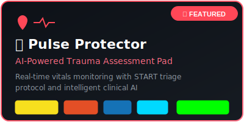
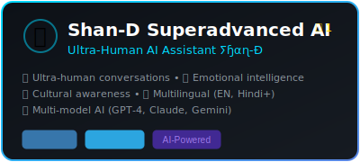
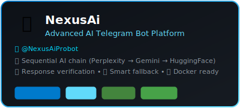
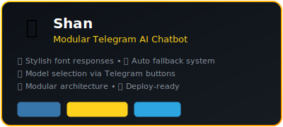
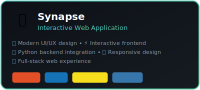
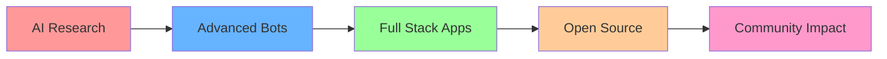

<div align="center">
  
  <!-- 3D Hero Banner -->
  
  
  <!-- GitHub Pro Badge -->
  <p>
    <a href="https://github.com/DenxVil">
      
    </a>
  </p>
  
  <!-- Profile Stats -->
  [](https://github.com/DenxVil)
  [](https://github.com/DenxVil)
  [](https://github.com/DenxVil)
  
  <!-- Call to Action Buttons -->
  <p>
    <a href="https://github.com/DenxVil?tab=followers">
      
    </a>
    <a href="https://t.me/xDenvil_bot">
      
    </a>
    <a href="mailto:NexusAisupport@gmail.com">
      
    </a>
  </p>
  
  <!-- Typing Animation -->
  
  
</div>

---

<div align="center">
  
  ## 🏆 GitHub Achievements
  
  
  
</div>

---

<div align="center">

### ✨ Welcome to My Dynamic Profile ✨



</div>

<div align="center">
  
</div>

<!-- Enhanced About Me Section -->
<div align="center">
  
</div>

## 👨‍💻 About Me

```typescript
// 🚀 Welcome to my profile!
interface Developer {
  name: string;
  title: string;
  location: string;
  currentFocus: string[];
  passions: string[];
  askMeAbout: string[];
}

const denvil: Developer = {
  name: "DenxVil",
  title: "AI Engineer & Full Stack Developer",
  location: "India 🇮🇳",
  
  currentFocus: [
    "🤖 Advanced AI Systems",
    "📱 Telegram Bot Development", 
    "🎯 Multi-Modal AI Integration",
    "🌐 Full Stack Web Applications"
  ],
  
  passions: [
    "✨ Creating Ultra-Human AI Assistants",
    "🏗️ Building Scalable Applications",
    "🔓 Open Source Contributions",
    "📚 Continuous Learning"
  ],
  
  askMeAbout: [
    "AI/ML 🧠", "Python 🐍", "JavaScript ⚡", "TypeScript 💙",
    "React ⚛️", "Node.js 🟢", "Telegram Bots 🤖", "MongoDB 🍃"
  ]
};

// Always coding, always learning! 💻✨
```

<div align="center">
  
  ### 🎯 Currently Working On
  
  
  
</div>

<div align="center">
  
</div>

## 🛠️ Tech Arsenal

<div align="center">

<!-- Animated header for Tech Arsenal -->

  
  ### 💻 Languages
  
  
  ### ⚡ Frameworks & Libraries
  
  
  ### 🤖 AI & ML
  
  
  
  
  
  ### 🗄️ Databases & Cloud
  
  
  ### 🔧 Tools
  
  
</div>

<div align="center">
  
</div>

## 🌟 Featured Projects

<div align="center">

<!-- Animated typing for section header -->


</div>

<div align="center">
  
</div>

<!-- ⭐ FEATURED: Pulse Protector -->
<div align="center">
  
### 🏥 Featured Project: Pulse Protector

<a href="https://github.com/DenxVil/Pulse-Protector-">
  
</a>

[](https://denxvil.github.io/Pulse-Protector-/)
[](https://github.com/DenxVil/Pulse-Protector-)

**Smart Trauma Vitals Assessment Pad** - Real-time patient vitals monitoring with START triage protocol and intelligent clinical AI decision support.

</div>

<div align="center">
  
</div>

### 🤖 AI-Powered Applications

<div align="center">

<table>
<tr>
<td align="center" width="50%">

<a href="https://github.com/DenxVil/Shan_D_Superadvanced">
  
</a>

</td>
<td align="center" width="50%">

<a href="https://github.com/DenxVil/NexusAi">
  
</a>

[](https://t.me/NexusAiProbot)

</td>
</tr>
<tr>
<td align="center" width="50%">

<a href="https://github.com/DenxVil/Shan">
  
</a>

</td>
<td align="center" width="50%">

<a href="https://github.com/DenxVil/Synapse">
  
</a>

</td>
</tr>
</table>

</div>

<div align="center">

### 🌐 Personal & Portfolio

#### 💼 [DenxVil.github.io](https://github.com/DenxVil/DenxVil.github.io)
**Personal Portfolio Website**


🌟 Personal showcase website with modern design and interactive features

</div>

<div align="center">
  
</div>

<!-- DYNAMIC_START -->
## 📊 Live GitHub Statistics

<div align="center">
  
  <a href="https://github.com/DenxVil">
    
    
  </a>
  
</div>

<div align="center">
  
  [](https://git.io/streak-stats)
  
</div>

<div align="center">
  
  
  
</div>

<div align="center">
  
  ### 💭 Random Dev Quote
  
  
  
</div>

<div align="center">
  
</div>

## 🌟 Top Repositories

<div align="center">
  
  <a href="https://github.com/DenxVil/Shan_D_Superadvanced">
    
  </a>
  <a href="https://github.com/DenxVil/NexusAi">
    
  </a>
  
  <a href="https://github.com/DenxVil/Pulse-Protector-">
    
  </a>
  
</div>

<!-- DYNAMIC_END -->

<div align="center">
  
</div>

## 🎯 Current Focus & Goals

<div align="center">



</div>

### 🎯 2025 Goals
- 🤖 Launch next-generation AI assistant with multimodal capabilities
- 🌐 Build comprehensive AI platform with web interface
- 📚 Contribute to open-source AI/ML projects
- 🚀 Scale existing projects to serve more users
- 🎓 Master advanced machine learning techniques

<div align="center">
  
</div>

## 📫 Connect & Collaborate

<div align="center">

### 🤝 Let's Build Something Amazing Together!

[](https://t.me/xDenvil_bot)
[](mailto:NexusAisupport@gmail.com)
[](https://github.com/DenxVil)
[](https://denxvil.github.io)

### 💬 Try My AI Assistants:
🤖 **Shan-D Superadvanced:** Available on Telegram  
🚀 **NexusAi Pro:** [@NexusAiProbot](https://t.me/NexusAiProbot)

### 📅 Recent Highlights

🎉 **2025** - Launched multiple AI-powered Telegram bots  
🚀 **2025** - Built full-stack applications with modern tech stack  
🤖 **2025** - Developed advanced AI assistant with multimodal capabilities  
💼 **Active** - Contributing to open-source AI/ML projects

</div>

<div align="center">
  
</div>

<div align="center">
  
  ### 🌟 Fun Facts About Me
  
  ```
  🧠 Building AI that understands humans better than humans understand themselves
  🌍 Passionate about making AI accessible to everyone
  🚀 Always excited about the next breakthrough in technology
  ☕ Powered by coffee and curiosity
  🎮 When not coding, you'll find me exploring new tech or gaming
  ```
  
  
  
  
  
  
  
  ### 💝 Show Some Love
  
  ⭐ **Star my repositories** if you find them interesting!  
  🍴 **Fork and contribute** to make them even better!  
  📢 **Share with others** who might benefit from these projects!
  
  
  
  
  
  <sub>💡 **Always open to collaboration on exciting AI and full-stack projects!**</sub>
  
  
  
  <sub>🤖 This profile features automated updates powered by GitHub Actions | Last updated: Daily at 00:00 UTC</sub>
  
  
  
</div>


