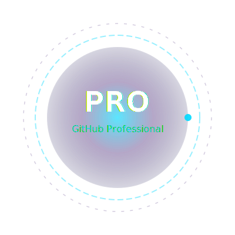
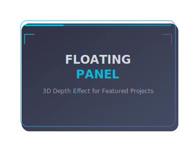
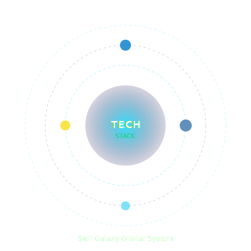
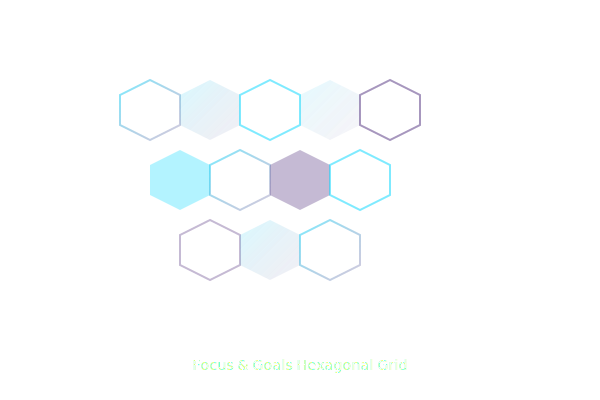
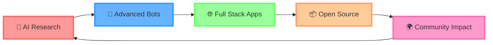

<div align="center">

<!-- 🎨 Layered 3D Hero Section -->
<picture>
  <source media="(prefers-color-scheme: dark)" srcset="./assets/hero-depth-base.svg">
  
</picture>


<br>

<!-- 🌟 PROMINENT GITHUB PRO HIGHLIGHT -->


<p>
  <a href="https://github.com/DenxVil">
    
  </a>
  <a href="https://github.com/DenxVil">
    
  </a>
</p>

<!-- ✨ Title with Glow Effect -->


<h1>
  
</h1>

<!-- 📊 Profile Metrics -->
<p>
  <a href="https://github.com/DenxVil">
    
  </a>
  <a href="https://github.com/DenxVil?tab=followers">
    
  </a>
  <a href="https://github.com/DenxVil?tab=repositories">
    
  </a>
</p>

<!-- 🎯 Quick CTAs -->
<p>
  <a href="https://github.com/DenxVil?tab=followers">
    
  </a>
  <a href="https://t.me/xDenvil_bot">
    
  </a>
  <a href="mailto:NexusAisupport@gmail.com">
    
  </a>
  <a href="https://denxvil.github.io">
    
  </a>
</p>

</div>

<br>

---

<br>

## 👨‍💻 About Me

<div align="center">
  
</div>

```javascript
const DenxVil = {
    name: "DenxVil",
    title: "AI Engineer & Full Stack Developer",
    location: "India 🇮🇳",
    githubStatus: "PRO ✨",
    
    currentFocus: [
        "🧠 Advanced AI Systems & Multi-Modal Integration",
        "🤖 Ultra-Human AI Assistant Development", 
        "📱 Next-Gen Telegram Bot Platforms",
        "🌐 Full Stack Web Applications with AI"
    ],
    
    passions: [
        "Creating AI that understands humans deeply",
        "Building scalable, intelligent applications",
        "Contributing to open-source AI/ML projects",
        "Continuous learning and innovation"
    ],
    
    techStack: {
        languages: ["Python", "JavaScript", "TypeScript", "HTML5", "CSS3"],
        aiFrameworks: ["OpenAI", "Google Gemini", "HuggingFace", "Perplexity"],
        frontend: ["React", "Vite", "Tailwind CSS"],
        backend: ["Node.js", "Express.js"],
        databases: ["MongoDB"],
        tools: ["Docker", "Git", "Azure", "Heroku"],
        specialties: ["Telegram Bot APIs", "AI Integration", "RESTful APIs"]
    },
    
    askMeAbout: [
        "AI/ML", "Python", "JavaScript", "TypeScript",
        "React", "Node.js", "Telegram Bots", "MongoDB",
        "Multi-Modal AI", "Full Stack Development"
    ],
    
    funFact: "Building AI that's more human than humans! ☕"
};
```

<div align="center">
  
  ### 🎯 Currently Working On
  
  <table>
    <tr>
      <td align="center">🧠<br><b>Advanced AI</b><br>Multi-modal systems</td>
      <td align="center">🤖<br><b>Smart Bots</b><br>Ultra-human assistants</td>
      <td align="center">🌐<br><b>Full Stack</b><br>Modern web apps</td>
      <td align="center">📊<br><b>AI Integration</b><br>Seamless experiences</td>
    </tr>
  </table>
  
</div>

---

<br>

## 🛠️ Tech Stack - Skill Galaxy

<div align="center">



<br><br>

### 💫 Core Technologies

<table>
<tr>
<td align="center" width="20%">
<br>
<b>Python</b><br>
<sub>Core Language</sub>
</td>
<td align="center" width="20%">
<br>
<b>JavaScript</b><br>
<sub>Web Development</sub>
</td>
<td align="center" width="20%">
<br>
<b>TypeScript</b><br>
<sub>Type Safety</sub>
</td>
<td align="center" width="20%">
<br>
<b>React</b><br>
<sub>Frontend</sub>
</td>
<td align="center" width="20%">
<br>
<b>Node.js</b><br>
<sub>Backend</sub>
</td>
</tr>
</table>

### 🤖 AI & Machine Learning


### 🎨 Frontend & Styling


### 🗄️ Backend & Databases


### ☁️ DevOps & Cloud


### 🛠️ Tools & Platforms


</div>

---

<br>

## 🌟 Featured Projects - Floating Panels

<div align="center">


### 🤖 AI-Powered Applications

</div>

<table>
<tr>
<td width="50%" valign="top">

#### 🧠 [Shan-D Superadvanced AI](https://github.com/DenxVil/Shan_D_Superadvanced)
**Ultra-Human AI Assistant** ⵢɧαɳ-Đ


🌟 **1 Star** | **Advanced AI Technology**

**Features:**
- 🎭 Ultra-Human conversation capabilities
- 🧠 Emotional intelligence & deep learning
- 📊 Complete user profiling & adaptation
- 🌍 Strong cultural awareness (Indian context)
- 🗣️ Multilingual support (English, Hindi+)
- 💾 Advanced memory & continuous learning
- 🔄 Multi-model AI integration (GPT-4, Claude, Gemini)
- 📸 Multimodal capabilities (images, videos, audio)

</td>
<td width="50%" valign="top">

#### 🚀 [NexusAi](https://github.com/DenxVil/NexusAi)
**Advanced AI Telegram Bot Platform**


**Bot:** [@NexusAiProbot](https://t.me/NexusAiProbot)

**Features:**
- 🔗 Sequential AI provider chain (Perplexity → Gemini → HuggingFace)
- ✅ Response verification system
- 🎯 Smart fallback mechanism
- 🌐 Full-stack web interface (React + Node.js)
- 📊 MongoDB integration
- 🔐 Secure API management
- ⚡ Real-time processing
- 🐳 Docker & Azure deployment ready

</td>
</tr>
</table>

<table>
<tr>
<td width="50%" valign="top">

#### 🤖 [Shan](https://github.com/DenxVil/Shan)
**Modular Telegram AI Chatbot**


**Features:**
- 🎨 Stylish font responses
- 🔄 Auto fallback system
- 🔘 Model selection via Telegram buttons
- 📦 Modular architecture
- 🚀 Deploy-ready (Heroku & Render)
- 🌐 Multiple AI API integration

</td>
<td width="50%" valign="top">

#### 🌐 [Synapse](https://github.com/DenxVil/Synapse)
**Interactive Web Application**


**Features:**
- 🎨 Modern UI/UX design
- ⚡ Interactive frontend
- 🐍 Python backend integration
- 📱 Responsive design

</td>
</tr>
</table>

<div align="center">

### 🌐 Personal & Portfolio

#### 💼 [DenxVil.github.io](https://github.com/DenxVil/DenxVil.github.io)
**Personal Portfolio Website**


🌟 Personal showcase website with modern design and interactive features

</div>

---

<!-- DYNAMIC_START -->
## 📊 Live GitHub Statistics

<div align="center">
  
  <!-- Note: stats.svg and top-langs.svg are dynamically generated by GitHub Actions workflow -->
  <!-- Placeholders are shown until first workflow run completes -->
  
  
  
</div>

<div align="center">
  
  [](https://git.io/streak-stats)
  
</div>

<div align="center">
  
  
  
</div>

---

## 🌟 Top Repositories

<div align="center">

*Top repositories will be dynamically updated by the GitHub Actions workflow*

</div>

<!-- DYNAMIC_END -->

---

<br>

## 🎯 Current Focus & Goals

<div align="center">



<br>



<br>

### 🎯 2024-2025 Goals & Roadmap

</div>

<table>
<tr>
<td width="50%" valign="top">

#### 🚀 Development Goals
- 🤖 Launch next-generation AI assistant with advanced multimodal capabilities
- 🌐 Build comprehensive AI platform with modern web interface
- 🔗 Integrate multiple AI providers with seamless fallback systems
- ⚡ Optimize performance and scalability for thousands of users
- 🎨 Create intuitive UIs for complex AI interactions

</td>
<td width="50%" valign="top">

#### 🌟 Community & Growth
- 📚 Contribute actively to open-source AI/ML projects
- 🎓 Master advanced machine learning and deep learning techniques
- 👥 Build collaborative developer community
- 📝 Share knowledge through documentation and tutorials
- 🌍 Scale projects to serve global user base

</td>
</tr>
</table>

<br>

---

## 📫 Connect & Collaborate

<div align="center">


<br>

### 🤝 Let's Build Something Amazing Together!

<p>
  <a href="https://t.me/xDenvil_bot">
    
  </a>
  <a href="mailto:NexusAisupport@gmail.com">
    
  </a>
  <a href="https://github.com/DenxVil">
    
  </a>
  <a href="https://denxvil.github.io">
    
  </a>
</p>

<br>

### 💬 Try My AI Assistants

<table>
  <tr>
    <td align="center" width="50%">
      <br>
      <b>Ultra-Human AI Assistant</b><br>
      <sub>Advanced conversational AI with emotional intelligence</sub>
    </td>
    <td align="center" width="50%">
      <a href="https://t.me/NexusAiProbot">
        
      </a><br>
      <b>Multi-Provider AI Platform</b><br>
      <sub>Sequential AI with smart fallback system</sub>
    </td>
  </tr>
</table>

<br>

### 📅 Recent Highlights & Achievements

| Year | Achievement |
|:---:|:---|
| 🎉 **2024** | Launched multiple AI-powered Telegram bots with thousands of users |
| 🚀 **2024** | Built full-stack applications using modern tech stack (React, Node.js, TypeScript) |
| 🤖 **2024** | Developed advanced AI assistant with multimodal capabilities (text, image, audio) |
| 💼 **2024** | Achieved GitHub Pro status and expanded open-source contributions |
| 🌟 **Active** | Continuously improving AI/ML projects and learning new technologies |

</div>

<br>

---

<br>

## 🌟 Fun Facts & Contribution

<div align="center">

### 🎭 About Me

<table>
  <tr>
    <td align="center">🧠</td>
    <td><b>Mission:</b> Building AI that understands humans better than humans understand themselves</td>
  </tr>
  <tr>
    <td align="center">🌍</td>
    <td><b>Vision:</b> Making AI accessible and beneficial to everyone, everywhere</td>
  </tr>
  <tr>
    <td align="center">🚀</td>
    <td><b>Passion:</b> Always excited about the next breakthrough in AI and technology</td>
  </tr>
  <tr>
    <td align="center">☕</td>
    <td><b>Fuel:</b> Powered by coffee, curiosity, and the desire to innovate</td>
  </tr>
  <tr>
    <td align="center">🎮</td>
    <td><b>Off-duty:</b> Exploring cutting-edge tech, gaming, or brainstorming the next big idea</td>
  </tr>
  <tr>
    <td align="center">🎯</td>
    <td><b>Motto:</b> "Code with purpose, build with passion, innovate without limits"</td>
  </tr>
</table>

<br>

---


---

<br>

### 💝 Show Some Love

<p>
  
  
  
</p>

⭐ **Star my repositories** if you find them interesting and useful!  
🍴 **Fork and contribute** to make them even better - PRs are always welcome!  
📢 **Share with others** who might benefit from these AI and development projects!

<br>

---

<br>

### ✨ "Building the future, one commit at a time" ✨

<sub>💡 **Always open to collaboration on exciting AI, ML, and full-stack projects!**</sub>

<br>

---

<br>

<sub>🤖 **This 3D profile features automated updates powered by GitHub Actions**</sub>  
<sub>📊 **Dynamic content refreshes daily at 00:00 UTC**</sub>  
<sub>🎨 **Modern 3D design with layered SVG assets for depth and visual appeal**</sub>

<br>


<br><br>

</div>
