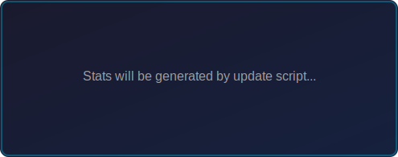
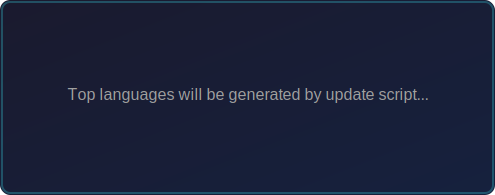
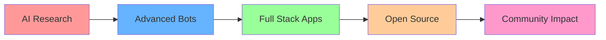

<div align="center">
  
  <!-- 3D Hero Banner -->
  
  
  <!-- GitHub Pro Badge -->
  <p>
    <a href="https://github.com/DenxVil">
      
    </a>
  </p>
  <p>
    <a href="https://github.com/DenxVil">
      
    </a>
  </p>
  
  <!-- Profile Stats -->
  [](https://github.com/DenxVil)
  [](https://github.com/DenxVil)
  [](https://github.com/DenxVil)
  
  <!-- Call to Action Buttons -->
  <p>
    <a href="https://github.com/DenxVil?tab=followers">
      
    </a>
    <a href="https://t.me/xDenvil_bot">
      
    </a>
    <a href="mailto:NexusAisupport@gmail.com">
      
    </a>
  </p>
  
  <!-- Typing Animation -->
  
  
</div>

---

<div align="center">

### ✨ Welcome to My Profile ✨


</div>

---

## 👨‍💻 About Me

```javascript
const denvil = {
    name: "DenxVil",
    title: "AI Engineer & Full Stack Developer",
    location: "India 🇮🇳",
    
    currentFocus: [
        "Advanced AI Systems",
        "Telegram Bot Development", 
        "Multi-Modal AI Integration",
        "Full Stack Web Applications"
    ],
    
    passions: [
        "Creating Ultra-Human AI Assistants",
        "Building Scalable Applications",
        "Open Source Contributions",
        "Continuous Learning"
    ],
    
    askMeAbout: [
        "AI/ML", "Python", "JavaScript", "TypeScript",
        "React", "Node.js", "Telegram Bots", "MongoDB"
    ]
};
```

<div align="center">
  
  ### 🎯 Currently Working On
  
  🤖 **Advanced AI Systems** | 🌐 **Full Stack Applications** | 📱 **Telegram Bot Platforms**
  
</div>

---

## 🛠️ Tech Stack & Skills

<div align="center">

### Programming Languages


### Frameworks & Libraries


### AI & Machine Learning


### Databases & Cloud


### Tools & Platforms


</div>

---

## 🌟 Featured Projects

<div align="center">

### 🤖 AI-Powered Applications

</div>

<table>
<tr>
<td width="50%" valign="top">

#### 🧠 [Shan-D Superadvanced AI](https://github.com/DenxVil/Shan_D_Superadvanced)
**Ultra-Human AI Assistant** ⵢɧαɳ-Đ


🌟 **1 Star** | **Advanced AI Technology**

**Features:**
- 🎭 Ultra-Human conversation capabilities
- 🧠 Emotional intelligence & deep learning
- 📊 Complete user profiling & adaptation
- 🌍 Strong cultural awareness (Indian context)
- 🗣️ Multilingual support (English, Hindi+)
- 💾 Advanced memory & continuous learning
- 🔄 Multi-model AI integration (GPT-4, Claude, Gemini)
- 📸 Multimodal capabilities (images, videos, audio)

</td>
<td width="50%" valign="top">

#### 🚀 [NexusAi](https://github.com/DenxVil/NexusAi)
**Advanced AI Telegram Bot Platform**


**Bot:** [@NexusAiProbot](https://t.me/NexusAiProbot)

**Features:**
- 🔗 Sequential AI provider chain (Perplexity → Gemini → HuggingFace)
- ✅ Response verification system
- 🎯 Smart fallback mechanism
- 🌐 Full-stack web interface (React + Node.js)
- 📊 MongoDB integration
- 🔐 Secure API management
- ⚡ Real-time processing
- 🐳 Docker & Azure deployment ready

</td>
</tr>
</table>

<table>
<tr>
<td width="50%" valign="top">

#### 🤖 [Shan](https://github.com/DenxVil/Shan)
**Modular Telegram AI Chatbot**


**Features:**
- 🎨 Stylish font responses
- 🔄 Auto fallback system
- 🔘 Model selection via Telegram buttons
- 📦 Modular architecture
- 🚀 Deploy-ready (Heroku & Render)
- 🌐 Multiple AI API integration

</td>
<td width="50%" valign="top">

#### 🌐 [Synapse](https://github.com/DenxVil/Synapse)
**Interactive Web Application**


**Features:**
- 🎨 Modern UI/UX design
- ⚡ Interactive frontend
- 🐍 Python backend integration
- 📱 Responsive design

</td>
</tr>
</table>

<div align="center">

### 🌐 Personal & Portfolio

#### 💼 [DenxVil.github.io](https://github.com/DenxVil/DenxVil.github.io)
**Personal Portfolio Website**


🌟 Personal showcase website with modern design and interactive features

</div>

---

<!-- DYNAMIC_START -->
## 📊 Live GitHub Statistics

<div align="center">
  
  
  
  
</div>

<div align="center">
  
  [](https://git.io/streak-stats)
  
</div>

<div align="center">
  
  
  
</div>

---

## 🌟 Top Repositories

<div align="center">

*Top repositories will be dynamically updated by the GitHub Actions workflow*

</div>

<!-- DYNAMIC_END -->

---

## 🎯 Current Focus & Goals

<div align="center">



</div>

### 🎯 2024 Goals
- 🤖 Launch next-generation AI assistant with multimodal capabilities
- 🌐 Build comprehensive AI platform with web interface
- 📚 Contribute to open-source AI/ML projects
- 🚀 Scale existing projects to serve more users
- 🎓 Master advanced machine learning techniques

---

## 📫 Connect & Collaborate

<div align="center">

### 🤝 Let's Build Something Amazing Together!

[](https://t.me/xDenvil_bot)
[](mailto:NexusAisupport@gmail.com)
[](https://github.com/DenxVil)
[](https://denxvil.github.io)

### 💬 Try My AI Assistants:
🤖 **Shan-D Superadvanced:** Available on Telegram  
🚀 **NexusAi Pro:** [@NexusAiProbot](https://t.me/NexusAiProbot)

### 📅 Recent Highlights

🎉 **2024** - Launched multiple AI-powered Telegram bots  
🚀 **2024** - Built full-stack applications with modern tech stack  
🤖 **2024** - Developed advanced AI assistant with multimodal capabilities  
💼 **Active** - Contributing to open-source AI/ML projects

</div>

---

<div align="center">
  
  ### 🌟 Fun Facts About Me
  
  ```
  🧠 Building AI that understands humans better than humans understand themselves
  🌍 Passionate about making AI accessible to everyone
  🚀 Always excited about the next breakthrough in technology
  ☕ Powered by coffee and curiosity
  🎮 When not coding, you'll find me exploring new tech or gaming
  ```
  
  ---
  
  
  
  ---
  
  ### 💝 Show Some Love
  
  ⭐ **Star my repositories** if you find them interesting!  
  🍴 **Fork and contribute** to make them even better!  
  📢 **Share with others** who might benefit from these projects!
  
  ---
  
  **✨ "Building the future, one commit at a time" ✨**
  
  <sub>💡 **Always open to collaboration on exciting AI and full-stack projects!**</sub>
  
  ---
  
  <sub>🤖 This profile features automated updates powered by GitHub Actions | Last updated: Daily at 00:00 UTC</sub>
  
  
  
</div>
