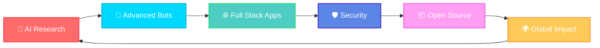

<!-- Animated Wave Header -->


<div align="center">

<!-- Typing Animation -->
<a href="https://git.io/typing-svg">
  
</a>

<br>

<!-- Profile Badges -->
<p>
  <a href="https://github.com/DenxVil">
    
  </a>
  
  <a href="https://github.com/DenxVil?tab=followers">
    
  </a>
</p>

<!-- Quick Action Buttons -->
<p>
  <a href="https://github.com/DenxVil?tab=followers">
    
  </a>
  <a href="https://t.me/xDenvil_bot">
    
  </a>
  <a href="mailto:NexusAisupport@gmail.com">
    
  </a>
  <a href="https://denx-vil-github-io.vercel.app">
    
  </a>
</p>

</div>

---

## 🏆 GitHub Achievements

<div align="center">
  
</div>

---

## 👨‍💻 About Me


```typescript
const DenxVil = {
    pronouns: "he" | "him",
    location: "India 🇮🇳",
    status: "GitHub Pro ✨",
    
    currentlyBuilding: {
        "🧠 Shan-D": "Ultra-Human AI Assistant",
        "🚀 NexusAi": "Multi-provider AI Platform",
        "🛡️ Pulse-Protector": "Security Application",
        "🌐 Portfolio": "Interactive Website"
    },
    
    expertise: {
        ai: ["GPT-4", "Claude 3.5", "Gemini", "HuggingFace", "Perplexity"],
        languages: ["Python", "TypeScript", "JavaScript", "HTML/CSS"],
        frameworks: ["React", "Node.js", "Express", "Vite", "Tailwind"],
        databases: ["MongoDB", "Redis"],
        devops: ["Docker", "Azure", "Heroku", "Vercel", "Render"]
    },
    
    achievements: {
        totalProjects: 6,
        totalStars: 11,
        aiBotsBuilt: 3,
        usersServed: "1000+"
    },
    
    motto: "Building AI that understands humans! 🚀"
};
```

<br clear="right"/>

<div align="center">

### 🎯 Currently Working On

<table>
  <tr>
    <td align="center" width="25%">🧠<br><b>AI Research</b><br><sub>Multi-modal systems</sub></td>
    <td align="center" width="25%">🤖<br><b>Smart Bots</b><br><sub>Ultra-human assistants</sub></td>
    <td align="center" width="25%">🌐<br><b>Full Stack</b><br><sub>Modern web apps</sub></td>
    <td align="center" width="25%">🛡️<br><b>Security</b><br><sub>Protection systems</sub></td>
  </tr>
</table>

</div>

---

## 🛠️ Tech Arsenal

<div align="center">

### 💻 Languages


### ⚡ Frameworks & Libraries


### 🤖 AI & Machine Learning
<p>
  
  
  
  
  
</p>

### 🗄️ Databases & Cloud


### 🔧 Tools & Platforms


</div>

---

## 🌟 Featured Projects

<div align="center">

### 🤖 AI-Powered Applications

</div>

<table>
<tr>
<td width="50%" valign="top">

### 🧠 [Shan-D Superadvanced](https://github.com/DenxVil/Shan_D_Superadvanced)
**Ultra-Human AI Assistant** ⵢɧαɳ-Đ


🔗 **[Live Demo](https://shan-d-superadvanced.onrender.com)**

- 🎭 Ultra-Human conversation with emotional intelligence
- 🧠 Multi-Model AI (GPT-4, Claude 3.5, Gemini)
- 📸 Multimodal: Images, videos, audio, documents
- 🛡️ Self-healing error system
- 🌍 Multilingual (English, Hindi+)
- 💾 Advanced memory & continuous learning

</td>
<td width="50%" valign="top">

### 🚀 [NexusAi](https://github.com/DenxVil/NexusAi)
**Advanced AI Telegram Bot Platform**


🤖 **[@NexusAiProbot](https://t.me/NexusAiProbot)**

- 🔗 Sequential AI: Perplexity → Gemini → HuggingFace
- ✅ Response verification & smart fallback
- 🌐 Full-stack: React + Node.js + MongoDB
- 🔐 JWT authentication & secure APIs
- 📊 Real-time WebSocket processing
- 🐳 Docker & Render ready

</td>
</tr>
</table>

<table>
<tr>
<td width="50%" valign="top">

### 🛡️ [Pulse-Protector](https://github.com/DenxVil/Pulse-Protector-)
**Advanced Security Application** 🆕


- 🔒 Advanced protection mechanisms
- 🛡️ Security-focused architecture
- ⚡ Real-time monitoring
- 📊 Threat detection system

</td>
<td width="50%" valign="top">

### 🤖 [Shan](https://github.com/DenxVil/Shan)
**Modular Telegram AI Chatbot**


- 🎨 Stylish font responses
- 🔄 Auto fallback system
- 🔘 Model selection via buttons
- 📦 Modular architecture
- 🚀 Deploy-ready (Heroku/Render)

</td>
</tr>
</table>

<table>
<tr>
<td width="50%" valign="top">

### 🌐 [Synapse](https://github.com/DenxVil/Synapse)
**Interactive Web Application**


- 🎨 Modern UI/UX design
- ⚡ Interactive frontend
- 🐍 Python backend
- 📱 Fully responsive

</td>
<td width="50%" valign="top">

### 💼 [Portfolio](https://github.com/DenxVil/DenxVil.github.io)
**Personal Portfolio Website**


🔗 **[Visit Site](https://denx-vil-github-io.vercel.app)**

- 🎨 Modern animated design
- ⚡ Interactive elements
- 📱 Mobile-first responsive
- 🌐 Deployed on Vercel

</td>
</tr>
</table>

<div align="center">

### 📌 Project Cards

<a href="https://github.com/DenxVil/Shan_D_Superadvanced">
  
</a>
<a href="https://github.com/DenxVil/NexusAi">
  
</a>

<a href="https://github.com/DenxVil/Pulse-Protector-">
  
</a>
<a href="https://github.com/DenxVil/DenxVil.github.io">
  
</a>

</div>

---

## 📊 GitHub Analytics

<div align="center">

<a href="https://github.com/DenxVil">
  
  
</a>

<br><br>

[](https://git.io/streak-stats)

<br>


</div>

---

## 💭 Random Dev Quote

<div align="center">


</div>

---

## 🎯 2025 Goals & Roadmap

<div align="center">



</div>

<table>
<tr>
<td width="50%" valign="top">

### 🚀 Development Goals
- 🤖 Launch next-gen AI with advanced multimodal
- 🌐 Build comprehensive AI platform
- 🔗 Integrate 5+ AI providers
- ⚡ Scale to 10,000+ users
- 🛡️ Complete Pulse-Protector suite

</td>
<td width="50%" valign="top">

### 🌟 Community Goals
- 📚 Contribute to open-source AI/ML
- 🎓 Master deep learning
- 👥 Build developer community
- 📝 Create tutorials
- 🏆 Achieve 50+ GitHub stars

</td>
</tr>
</table>

---

## 📫 Connect & Collaborate

<div align="center">

### 🤝 Let's Build Something Amazing!

<p>
  <a href="https://t.me/xDenvil_bot">
    
  </a>
  <a href="mailto:NexusAisupport@gmail.com">
    
  </a>
</p>
<p>
  <a href="https://github.com/DenxVil">
    
  </a>
  <a href="https://denx-vil-github-io.vercel.app">
    
  </a>
</p>

### 🤖 Try My AI Bots

| Bot | Description |
|-----|-------------|
| [🧠 Shan-D](https://shan-d-superadvanced.onrender.com) | Ultra-Human AI with emotional intelligence |
| [🚀 NexusAi](https://t.me/NexusAiProbot) | Multi-provider AI platform |

### 📅 2025 Achievements

| Date | Achievement |
|:---:|:---|
| 🆕 Nov 2025 | Launched Pulse-Protector |
| 🎉 2025 | 11+ stars across repos |
| 🚀 2025 | 6 public repositories |
| 🤖 2025 | 3 AI-powered bots |
| 💼 2025 | GitHub Pro status |

</div>

---

## 🐍 Contribution Snake

<div align="center">


</div>

---

<div align="center">

### 🌟 Fun Facts

| | |
|:---:|:---|
| 🧠 | Building AI that understands humans |
| 🌍 | Making AI accessible to everyone |
| 🚀 | Excited about tech breakthroughs |
| ☕ | Powered by coffee & curiosity |
| 💡 | "Code with purpose, build with passion" |

---

### 💝 Support

⭐ **Star** my repos if you find them useful!  
🍴 **Fork** and contribute!  
📢 **Share** with others!

---

### ✨ "Building the future, one commit at a time" ✨

<sub>💡 Open to collaboration on AI & full-stack projects!</sub>

---


</div>

<!-- Wave Footer -->
