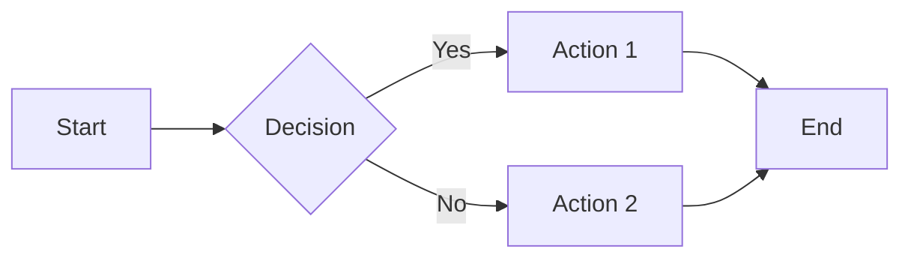

# Markdown Visual Test File

This file contains a comprehensive set of markdown constructs for testing rendering and styling. It includes samples of 3D-style patterns used in the main README for prototyping and preview purposes.

---

## Table of Contents

- [Headings](#headings)
- [Text Formatting](#text-formatting)
- [Lists](#lists)
- [Blockquotes](#blockquotes)
- [Code](#code)
- [Tables](#tables)
- [Links and Images](#links-and-images)
- [Task Lists](#task-lists)
- [3D Style Samples](#3d-style-samples)

---

## Headings

# Heading 1
## Heading 2
### Heading 3
#### Heading 4
##### Heading 5
###### Heading 6

---

## Text Formatting

This is **bold text**.

This is *italic text*.

This is ***bold and italic text***.

This is ~~strikethrough text~~.

This is `inline code`.

This is a [link](https://github.com).

---

## Lists

### Unordered List

- Item 1
- Item 2
  - Nested item 2.1
  - Nested item 2.2
    - Deeply nested item 2.2.1
- Item 3

### Ordered List

1. First item
2. Second item
   1. Nested item 2.1
   2. Nested item 2.2
3. Third item

### Mixed List

1. First item
   - Bullet point
   - Another bullet
2. Second item
   * Different bullet style
   * Another one

---

## Blockquotes

> This is a blockquote.
> It can span multiple lines.

> Nested blockquote:
>> This is nested level 1
>>> This is nested level 2

> **Bold in blockquote**
>
> *Italic in blockquote*
>
> `Code in blockquote`

---

## Code

### Inline Code

Use `git status` to check repository status.

### Code Blocks

#### Without Language

```
This is a code block
without language specification
Multiple lines supported
```

#### With Language (JavaScript)

```javascript
const greeting = "Hello, World!";
function sayHello(name) {
  console.log(`Hello, ${name}!`);
  return true;
}
sayHello("GitHub");
```

#### With Language (Python)

```python
def calculate_sum(a, b):
    """Calculate sum of two numbers"""
    return a + b

result = calculate_sum(10, 20)
print(f"Result: {result}")
```

#### With Language (Bash)

```bash
#!/bin/bash
echo "Testing markdown code blocks"
git status
npm install
```

---

## Tables

### Simple Table

| Column 1 | Column 2 | Column 3 |
|----------|----------|----------|
| Row 1    | Data     | Info     |
| Row 2    | Data     | Info     |
| Row 3    | Data     | Info     |

### Table with Alignment

| Left Aligned | Center Aligned | Right Aligned |
|:-------------|:--------------:|--------------:|
| Left         | Center         | Right         |
| Text         | Text           | Text          |
| More         | Content        | Here          |

### Complex Table with Formatting

| Feature | Status | Notes |
|---------|--------|-------|
| **Bold** | ✅ | *Italic* works |
| `Code` | ✅ | Inline code works |
| [Links](https://github.com) | ✅ | Links work too |

---

## Links and Images

### Links

[Regular Link](https://github.com)

[Link with Title](https://github.com "GitHub Homepage")

### Reference-Style Links

[Reference link][ref-id]

[Another reference][another-ref]

[ref-id]: https://github.com
[another-ref]: https://github.com/features

### Images


### Image as Link

[](https://github.com)

---

## Task Lists

- [x] Completed task
- [x] Another completed task
- [ ] Incomplete task
- [ ] Another incomplete task
  - [x] Nested completed subtask
  - [ ] Nested incomplete subtask

---

## Horizontal Rules

Three different styles:

---

***

___

---

## HTML Elements in Markdown

<div align="center">

### Centered Content

This content is centered using HTML div tags.

</div>

<details>
<summary>Click to expand</summary>

This is collapsible content using HTML details/summary tags.

- Item 1
- Item 2
- Item 3

</details>

<kbd>Ctrl</kbd> + <kbd>C</kbd> - Keyboard shortcuts

<sub>Subscript text</sub> and <sup>Superscript text</sup>

---

## Emoji Support

:smile: :heart: :rocket: :star: :fire: :tada:

🚀 🌟 💻 🎨 📊 🔥

---

## 3D Style Samples

### Sample 1: 3D ASCII Banner

<div align="center">
<pre>
╔══════════════════════════════════════════════════════════╗
║                                                          ║
║    ████████╗ ███████╗ ███████╗ ████████╗               ║
║    ╚══██╔══╝ ██╔════╝ ██╔════╝ ╚══██╔══╝               ║
║       ██║    █████╗   ███████╗    ██║                  ║
║       ██║    ██╔══╝   ╚════██║    ██║                  ║
║       ██║    ███████╗ ███████║    ██║                  ║
║       ╚═╝    ╚══════╝ ╚══════╝    ╚═╝                  ║
║                                                          ║
║              ⟨ Sample Title ⟩                           ║
╚══════════════════════════════════════════════════════════╝
</pre>
</div>

### Sample 2: 3D Layered Divider

<div align="center">
<pre>
▓▓▓▓▓▓▓▓▓▓▓▓▓▓▓▓▓▓▓▓▓▓▓▓▓▓▓▓▓▓▓▓▓▓▓▓▓▓▓▓▓▓▓▓▓▓▓▓▓▓▓▓▓▓▓▓▓▓▓▓▓▓▓▓▓▓▓▓▓▓▓▓▓
▒▒▒▒▒▒▒▒▒▒▒▒▒▒▒▒▒▒▒▒▒▒▒▒▒▒▒▒▒▒▒▒▒▒▒▒▒▒▒▒▒▒▒▒▒▒▒▒▒▒▒▒▒▒▒▒▒▒▒▒▒▒▒▒▒▒▒▒▒▒▒▒▒
░░░░░░░░░░░░░░░░░░░░░░░░░░░░░░░░░░░░░░░░░░░░░░░░░░░░░░░░░░░░░░░░░░░░░░░░░░░
</pre>
</div>

### Sample 3: 3D Card Layout

<div align="center">
<table>
  <tr>
    <td align="center" width="33%">
      <pre>
╔═══════════╗
║   🎨      ║
║  Sample   ║
║   Card    ║
╚═══════════╝
 ╚═══════════╝
      </pre>
      <b>Card Title 1</b><br>
      <sub><sup>▓</sup> Description <sup>▓</sup></sub>
    </td>
    <td align="center" width="33%">
      <pre>
╔═══════════╗
║   🚀      ║
║  Sample   ║
║   Card    ║
╚═══════════╝
 ╚═══════════╝
      </pre>
      <b>Card Title 2</b><br>
      <sub><sup>▓</sup> Description <sup>▓</sup></sub>
    </td>
    <td align="center" width="33%">
      <pre>
╔═══════════╗
║   ⚡      ║
║  Sample   ║
║   Card    ║
╚═══════════╝
 ╚═══════════╝
      </pre>
      <b>Card Title 3</b><br>
      <sub><sup>▓</sup> Description <sup>▓</sup></sub>
    </td>
  </tr>
</table>
</div>

### Sample 4: 3D Typography Effect

<div align="center">
<h3>
<sub>░</sub> <sup>▒</sup> ▓ <b>S T Y L E D&nbsp;&nbsp;&nbsp;H E A D E R</b> ▓ <sup>▒</sup> <sub>░</sub>
</h3>
</div>

### Sample 5: Decorative Border

<div align="center">
<pre>
╔═══════════════════════════════════════════════════════════════════════╗
║                                                                       ║
║    ▓▓▓▓▓▓▓▓▓▓▓▓▓▓▓▓▓▓▓▓▓▓▓▓▓▓▓▓▓▓▓▓▓▓▓▓▓▓▓▓▓▓▓▓▓▓▓▓▓▓▓▓▓▓▓▓▓▓▓▓▓   ║
║     ▒▒▒▒▒▒▒▒▒▒▒▒▒▒▒▒▒▒▒▒▒▒▒▒▒▒▒▒▒▒▒▒▒▒▒▒▒▒▒▒▒▒▒▒▒▒▒▒▒▒▒▒▒▒▒▒▒▒▒    ║
║      ░░░░░░░░░░░░░░░░░░░░░░░░░░░░░░░░░░░░░░░░░░░░░░░░░░░░░░░░░░░     ║
║                                                                       ║
║                      Content Goes Here                               ║
║                                                                       ║
║      ░░░░░░░░░░░░░░░░░░░░░░░░░░░░░░░░░░░░░░░░░░░░░░░░░░░░░░░░░░░     ║
║     ▒▒▒▒▒▒▒▒▒▒▒▒▒▒▒▒▒▒▒▒▒▒▒▒▒▒▒▒▒▒▒▒▒▒▒▒▒▒▒▒▒▒▒▒▒▒▒▒▒▒▒▒▒▒▒▒▒▒▒    ║
║    ▓▓▓▓▓▓▓▓▓▓▓▓▓▓▓▓▓▓▓▓▓▓▓▓▓▓▓▓▓▓▓▓▓▓▓▓▓▓▓▓▓▓▓▓▓▓▓▓▓▓▓▓▓▓▓▓▓▓▓▓▓   ║
║                                                                       ║
╚═══════════════════════════════════════════════════════════════════════╝
</pre>
</div>

### Sample 6: Collapsible 3D Section

<details>
<summary><b>🔷 Click to expand 3D Content</b></summary>

<br>

<div align="center">
<pre>
┏━━━━━━━━━━━━━━━━━━━━━━━━━━━━━━━━━━━━━━━━━━━━━━━━━┓
┃                                                 ┃
┃    This is expandable 3D styled content        ┃
┃                                                 ┃
┃    ▓ Feature 1                                  ┃
┃    ▓ Feature 2                                  ┃
┃    ▓ Feature 3                                  ┃
┃                                                 ┃
┗━━━━━━━━━━━━━━━━━━━━━━━━━━━━━━━━━━━━━━━━━━━━━━━━━┛
</pre>
</div>

Content inside collapsible section with 3D styling.

</details>

---

## Badge Samples


---

## Nested Structures

### List with Code

- Item with `inline code`
- Item with code block:
  ```javascript
  const x = 10;
  console.log(x);
  ```
- Item with nested list:
  1. Sub-item 1
  2. Sub-item 2

### Table in Blockquote

> | Column A | Column B |
> |----------|----------|
> | Data 1   | Data 2   |
> | Data 3   | Data 4   |

### Blockquote with List

> - Point 1
> - Point 2
>   - Nested point 2.1
>   - Nested point 2.2
> - Point 3

---

## Mermaid Diagrams (if supported)



---

## Special Characters and Symbols

### Unicode Box Drawing

```
┌─┬─┐  ╔═╦═╗  ╭─┬─╮
├─┼─┤  ╠═╬═╣  ├─┼─┤
└─┴─┘  ╚═╩═╝  ╰─┴─╯
```

### Geometric Shapes

```
■ □ ▢ ▣ ▤ ▥ ▦ ▧ ▨ ▩
● ○ ◉ ◎ ◐ ◑ ◒ ◓ ◔ ◕
▲ △ ▴ ▵ ▶ ▷ ▸ ▹ ► ▻
◢ ◣ ◤ ◥
```

### Shading Characters

```
░░░ Light
▒▒▒ Medium
▓▓▓ Dark
███ Solid
```

### Arrows

```
← → ↑ ↓ ↔ ↕
⇐ ⇒ ⇑ ⇓ ⇔ ⇕
⟵ ⟶ ⟷
```

---

## Footer

<div align="center">

**End of Markdown Visual Test File**

This file is for testing and prototyping markdown rendering and 3D visual styles.

<sub>Last updated: 2025</sub>

</div>
